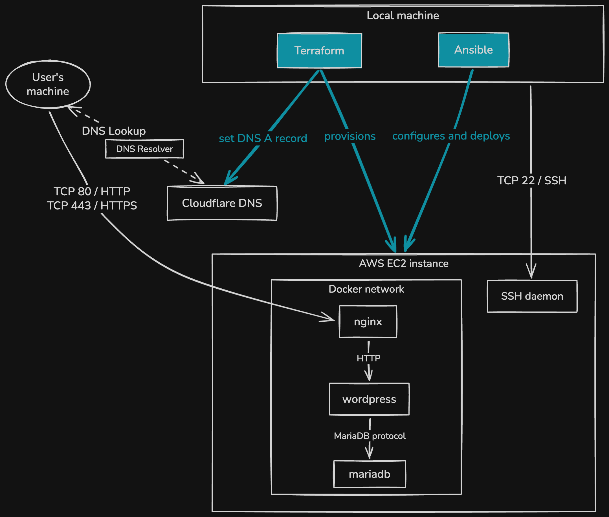

# Cloud-1


<div align="center">
  <em>  
    This project was created as part of the 42 curriculum by <a href="https://github.com/jasonmgl">jmougel</a> and <a href="https://github.com/ysengoku">yusengok</a>.
  </em>
  <br /><br />
  
  
  
</div>


## Description

This project builds on one of 42's earlier projects [Inception](https://github.com/ysengoku/42-Inception), where WordPress, MariaDB, and a few bonus services were each containerized from scratch and orchestrated with Docker Compose.   
   
**Cloud-1** focuses on the three core containers (WordPress, MariaDB, NGINX) and deploys them to a cloud provider instance, replacing manual setup with full automation using Ansible. The result is a reproducible, hands-off deployment where a single playbook run takes a fresh instance to a fully running WordPress site.   See [docs/IMPLEMENTATION_NOTES.md](docs/IMPLEMENTATION_NOTES.md) for details on how each capability is implemented.

## Objectives

The goal of this project is to build a fully automated, reproducible cloud deployment: provisioning real infrastructure with Terraform, configuring it idempotently with Ansible, and handling concerns a purely local setup doesn't need to, such as secrets management, TLS, and firewalling.

## Features

- Provisioning an AWS instance and deploys in one command, no manual instance creation needed via **Terraform**.
- Fully automated deployment via **Ansible**, from a bare Ubuntu 22.04-LTS like instance to a running site.
- Each service runs in its own container, defined in a **docker-compose.yml**, and containers communicate over an internal network.
- Survives reboots: containers restart on their own, and all data such as posts, media, accounts persists.
- Portable playbook that works on any fresh instance and can stand up multiple servers side by side.
- Locked down by default: only SSH, HTTP, and HTTPS are reachable from outside, everything else (including the database) stays internal. TLS where feasible.
- Roles are organized for maintainability, the playbook is idempotent, and secrets are stored in Ansible Vault while the Docker `.env` is rendered on the target host.

## Architecture



## Constraints

- The target environment can only be assumed to be a plain Ubuntu 22.04 LTS-like instance with SSH and Python
- Only SSH, HTTP, and HTTPS (22, 80, 443) are exposed externally. Everything else is blocked
- Docker Compose is mandatory for orchestration
- One long-lived foreground process per container (1 process = 1 container)

## Tech Stack

**Tools:**
<div>        
  
  
  
  
  
  
  
</div>
<br />

**Languages:**   
<div>   
  
  
  
</div>
<br />

**Environment:**   
<div>
  
  
  
  
</div>

## Prerequisites

### On the local machine

- `make`
- `curl`
- `pipx`
- `unzip`

### On AWS

- An IAM user with active access key

   
> [!NOTE]     
> Ansible alone can also target a manually created server on any provider. That server needs a sudo-capable non-root user with the SSH public key installed.   
> Some providers set this up automatically, others (e.g. DigitalOcean) require creating it by hand:
> ```bash
> ssh -i <private_key> root@<target IP>
>
> adduser <username>
> usermod -aG sudo <username>
>
> mkdir -p /home/<username>/.ssh
> cp ~/.ssh/authorized_keys /home/<username>/.ssh/authorized_keys
> chown -R <username>:<username> /home/<username>/.ssh
> chmod 700 /home/<username>/.ssh
> chmod 600 /home/<username>/.ssh/authorized_keys
>
> # NOPASSWD entry is required for Ansible's non-interactive sudo (become).
> echo "<username> ALL=(ALL) NOPASSWD:ALL" > /etc/sudoers.d/<username>
>
> chmod 440 /etc/sudoers.d/<username>
> ```

### On Cloudflare


## Instructions

### Installation

```bash
git clone https://github.com/ysengoku/Cloud-1.git && \
cd Cloud-1
```

Create a `.env` and `.vault_password`
```bash
cp .env.sample .env
# Fill in the IAM user's access key ID and secret access key

cp ./ansible/.vault_password.sample ./ansible/.vault_password
# Paste in the vault password shared by your team
```

To use a real domain name instead of the bare IP, create `terraform/terraform.tfvars`:
```hcl
domain_name          = "cloud1.example.com"
cloudflare_zone_name = "example.com"
```
The Cloudflare API token is read from `vault_dns_api_token` in the vault (see [docs/TERRAFORM.md](docs/TERRAFORM.md) for details); no extra setup needed there. Leave `domain_name` unset to keep using the bare IP with a self-signed certificate.

> [!NOTE] 
> To start with a fresh vault, see [docs/VAULT.md](docs/VAULT.md).

### Usage

```bash
make up
# install tools, log into AWS, provision the instance with Terraform, deploy with Ansible

make down 
# stop the EC2 instance without destroying it

make clean
# remove the generated Ansible inventory files

make destroy
# remove the inventory and destroy the AWS infrastructure

make re
# destroy then up

make fclean
# destroy the infrastructure and uninstall the local tools make up installed

make reboot
# reboot the target instance and wait for it to come back up
```

> [!NOTE]   
> To use Ansible alone (see [Prerequisites](#prerequisites)), without Terraform, `make provision` runs just the Ansible playbook. It reads `ansible/inventory.yaml`, which is normally generated by Terraform, so create that file yourself first, with this content:
> ```yaml
> # ansible/inventory.yaml
> all:
>   children:
>     web:
>       hosts:
>         web-1:
>           ansible_host: <target IP>
>           ansible_ssh_private_key_file: <path to private key>
>           ansible_ssh_user: <username>
> ```

## Access

The site is reachable at `https://<domain_name>`.   
It can take a short while to become ready after `make` finishes (a few retries a moment later should return 200).

## Validation

```bash
make test
# ping the target host over Ansible to confirm connectivity

curl -Ik https://<domain_name>
# expect HTTP/2 200
```

Expected result:
- Ansible can reach the target host.
- The site returns HTTP 200 and is reachable in a browser.

## Notes

- `make fclean` destroys the AWS infrastructure and uninstalls the local tools `make up` installed. Use with caution.
- With a bare IP (no domain configured), the certificate is self-signed and browsers will show a warning on first visit.
- Let's Encrypt limits new certificates to 5 per exact domain name within a rolling 7-day window, shared across every request for that domain, not per Cloudflare account or IP. Repeated testing, or multiple people deploying against the same `domain_name`, can hit this limit quickly. Set your own subdomain in `domain_name` (e.g. `cloud1-yourname.example.com`) under the same `cloudflare_zone_name` to avoid sharing the quota with others.

## Project Structure

```bash
.
├── terraform/
├── ansible/
│   ├── group_vars
│   │   └── all
│   │       ├── vars.yaml
│   │       └── vault.yaml
│   ├── roles/
│   ├── src/
│   ├── playbook.yaml
│   ├── requirements.yaml
│   ├── ansible.cfg
│   └── .vault_password
├── scripts/
├── mise.toml
├── .env
└── Makefile
```

## Resources

- [Ansible documentation](https://docs.ansible.com/)
- [Terraform documentation](https://developer.hashicorp.com/terraform/docs)

## AI Usage

AI was mainly used to:
- better understand concepts
- generate diagrams
- improve documentation
- reformulate explanations

## Author

- jmougel (GitHub: [jasonmgl](https://github.com/jasonmgl))
- yusengok (GitHub: [ysengoku](https://github.com/ysengoku))

## License

This project is for educational purposes.
