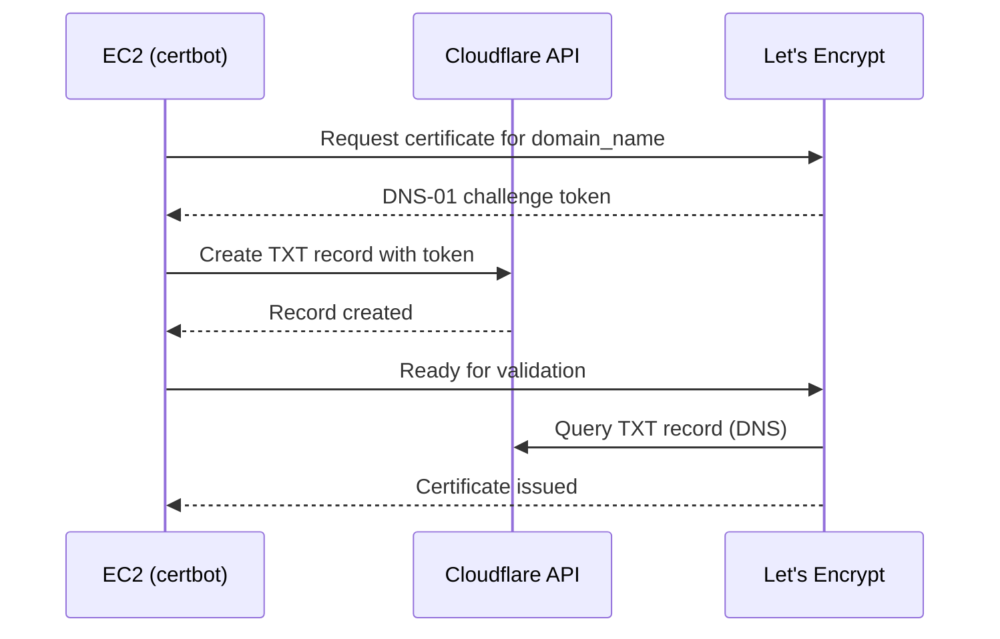

# Playbook walkthrough

This records the reasoning behind each task in the playbook, in execution order.

`ansible/group_vars/all/vars.yaml` and `ansible/group_vars/all/vault.yaml` are loaded automatically by Ansible for every host, no `vars_files:` needed.   

- `vars.yaml` holds the plain variables referenced below;
- secrets are defined once in `vault.yaml` under a `vault_`-prefixed name (e.g. `vault_sql_password`) and re-exposed under their plain name in `vars.yaml` (e.g. `sql_password: "{{ vault_sql_password }}"`), so no task ever needs to know which variables are secret.
- `domain_name` defaults to `{{ ansible_host }}`, so a bare IP is used automatically unless a real domain is set.

---

## Wait for SSH / gather facts

The first play disables automatic fact-gathering and instead runs `ansible.builtin.wait_for_connection` followed by an explicit `ansible.builtin.setup` as `pre_tasks`. A freshly created Terraform instance can take a little while after `aws_instance` reports "created" before its SSH daemon actually accepts connections; `wait_for_connection` retries until it does (or times out) instead of failing outright on the first attempt.

## Prerequisites play

### `common`
- Reboot-if-required runs before anything else, so Docker isn't installed right before an unrelated pending reboot forces a restart mid-setup.
- `ca-certificates` and `curl` are installed first. All subsequent HTTPS operations, including fetching Docker's GPG key, obtaining Let's Encrypt certificates, and calling the Cloudflare API, depend on them.

### `docker_engine`

Ubuntu's default repos only ship `docker.io`, an older repackaging without `docker-ce` or `docker-compose-plugin`. The official Docker apt repo is required to get the real packages.
- The GPG key is fetched and passed as `signed_by` on the repo definition, so that apt verifies packages against Docker's actual signing key instead of trusting the repo blindly.
- `dpkg --print-architecture` is read dynamically instead of hardcoding `amd64`/`arm64`, so the same playbook works on any instance architecture.
- `docker-compose-plugin` is the package that provides the `docker compose` subcommand the `start` role relies on.
- The service is explicitly enabled (not just started), so Docker comes back up on its own after a reboot.
- No `docker` group setup: Ansible connects as `ubuntu` and uses `become: true` for every task, so it always has root-level Docker access regardless. Logging in and running `docker` commands directly as `ubuntu` still needs an explicit `sudo`, since that user was never added to the `docker` group.

### `security`
- ufw's default-deny policy and the SSH/HTTP/HTTPS allow rules are set up before `ufw enable`. Order matters: enabling ufw before the SSH rule exists would cut the current SSH session immediately (lockout on a remote box with no console access).

## Deploy Inception Project play

### `sync_project`

- `src/` (Dockerfiles, nginx conf, compose file) is copied as-is.
- The project directory task does not use `recurse: yes`: recursively forcing a fixed mode/owner on every file under `src/` would fight with `ansible.builtin.copy`'s own per-file permissions on every subsequent run, showing spurious `changed` even when nothing actually changed. The directory only needs to exist with the right top-level permissions before `copy` populates it.
- The stale `.env` is explicitly removed before rendering a new one, because `ansible.builtin.template` only overwrites the keys the current template defines. If a key is ever dropped from `env.j2`, a leftover file would keep silently serving the old value instead of reflecting the current template.
- `.env` needs secrets injected, so it's rendered from a template at `project_path/src/.env`, matching where `docker-compose.yml`'s `env_file:` looks for it. If this path doesn't match the compose file's expectation, the containers start with no environment variables at all, and `docker compose` won't raise any error about it.

### `tls`

- [Let's Encrypt](https://letsencrypt.org/) cannot issue certificates for bare IP addresses, only DNS-validated domains. `is_ip_address` routes IP-only deploys down a different path (self-signed). It's computed with the `ansible.utils.ip_address` test rather than a hand-rolled regex, so it correctly validates real IPv4/IPv6 addresses (e.g. rejects `999.999.999.999`) instead of just counting digit groups.
- The DNS-01 challenge is an ACME (Automatic Certificate Management Environment) validation method used by Certificate Authorities such as Let's Encrypt. Unlike the HTTP-01 challenge, it does not require port 80 to be serving the site during validation. Instead, it only requires a Cloudflare API token with permission to create a temporary TXT record. As a result, certificates can be obtained before the site is even up.
- `--deploy-hook "... || true"`: the hook fires on the very first issuance too, but at that point the `nginx` container doesn't exist yet (it's created by the next role). Swallowing the error lets the first run succeed while still reloading nginx correctly on future renewals.
- The self-signed certificate is written to the same path shape (`/etc/letsencrypt/live/<domain_name>/...`) that certbot would use, so `nginx.conf.template` can reference one fixed path regardless of which branch ran. No conditional nginx config needed.

### `start`

- Runs after both `sync_project` and `tls`, not before: nginx bind-mounts `/etc/letsencrypt` and needs a certificate file to already exist at container start, otherwise nginx fails to start.
- Uses `community.docker.docker_compose_v2` rather than a raw `ansible.builtin.command` call to `docker compose up`. A raw command has no idea whether anything actually changed and would report `changed` on every single run; this module inspects the containers' actual state and reports `changed`/`ok` accordingly.
- `build: always` forces an image rebuild every deploy so Dockerfile/script changes actually take effect, equivalent to `docker compose up --build`. Paired with `ignore_build_events: true`, the build step itself is never counted as a change; only an actual container recreation is.

> [!NOTE]
> `ignore_build_events: true` doesn't fully guarantee idempotency.
> If the build cache is ever invalidated (a recreated instance, an evicted Docker build cache, etc.), the Dockerfiles' unpinned `apt install` can resolve to newer package versions than the previous build, producing a different image and a real container recreation.

## Design decisions worth remembering

- **Named volumes** Volumes such as `mariadb` use plain Docker-managed named volumes rather than bind-mounting a host path. `docker volume rm` fully deletes a named volume's data, so that `down -v` followed by a redeploy reliably starts from a clean state. A bind mount would leave the underlying host directory (and its data) untouched by `docker volume rm`, so a "clean" redeploy could silently keep serving old data instead.
- **The Compose project name is a fixed constant** (`inception`), not left to Compose's default of deriving it from the directory holding the compose file. A fixed name keeps every command that addresses this deployment (the playbook itself, a manual `docker compose -p inception ...`) pointed at the same project regardless of where the files happen to live on disk.
- **`project_path` defaults to `/opt/inception`**, not a path under a user's home directory. Ansible connects as `ubuntu` but runs every task with `become: true`; keeping app files out of any one user's home directory avoids coupling the deploy path to whichever user happens to SSH in.
